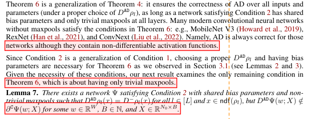

# PDF 短尾段检测

找出论文正文和附录末行过短的段落，在 PDF 中标记位置。适用于有文字层的英文单栏论文，无需 TeX 源码，使用 CPU 运行。



淡红底色标出短尾候选，橙色虚线是阈值。示例取自 [What does automatic differentiation compute for neural networks?](test/fixtures/iclr/what-does-automatic-differentiation-compute.pdf) 第 7 页。

## 使用

需要 Python 3.12。首次安装时下载官方 PP-DocLayout-M 权重并转换为 ONNX：

```sh
python3.12 -m venv .venv
.venv/bin/pip install -r requirements-model.txt
.venv/bin/python scripts/prepare_model.py --export
.venv/bin/python pdf_tail_detector.py paper.pdf
```

结果保存在 `outputs/results/paper.tail-marked.pdf` 和 `outputs/results/paper.tail-marked.json`。参考文献和图文绕排段落跳过，附录继续检查；JSON 同时记录待复核项和检查范围。

默认阈值是正文宽度的 75%，可用 `--tail-ratio` 调整；`--ratio` 保留旧版整页比例。其他参数见 `--help`。

## 测试

```sh
.venv/bin/pip install -r requirements-test.txt
.venv/bin/python -m pytest -q
.venv/bin/ruff check .
```

源码在 `src/`，测试与夹具在 `test/`，演示图在 `assets/`。`outputs/` 下：`results/` 放检测结果，`checks/` 放验证产物，`cache/` 放模型与测试缓存。
